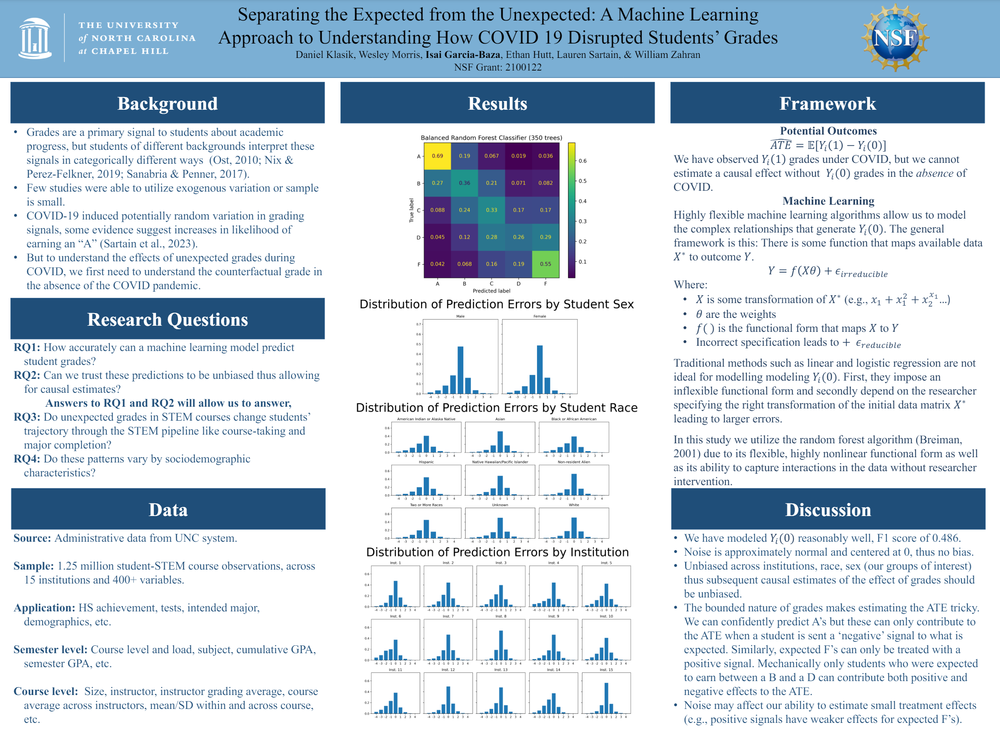

# NSF STEM
The goal of this project is to model undergraduate student performance as measured by grades in STEM courses. I approached this as both a classification and regression problem.

The project primarily relies on Stata for data cleaning and the Python libraries `scikit-learn` for the learning algorithms and `imbalanced-learn` to address class imbalance.

Inputs: Raw administrative data from several DB's.
Outputs: Predicted STEM course grades based on available data.

This work is ongoing, and this repo is not updated live.


## Organization
The `./data_cleaning/` folder contains all `.do` files used to clean the training data. The entire procedure can be completed by running the `./data_cleaning/0.0_data_cleaning_control.do` file.

The `./src/` folder contains the Python code used to train and test various learning algorithms for our problem. This procedure can be completed by running the `./src/master.py` file.


## Environment Setup using Anaconda and Bash terminal
```bash
conda create --prefix=$HOME/myenvs/nsfstem python=3.10
source activate $HOME/myenvs/nsfstem
pip install -r PATHTOPROJECTFOLDER/requirements.txt
pip install --upgrade gensim
```

## Latest
I attended the Association for Education Finance and Policy 2024 conference where I presented progress in this work. We received great feedback and will be including additional analyses and modelling strategies.


